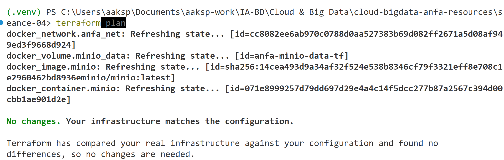
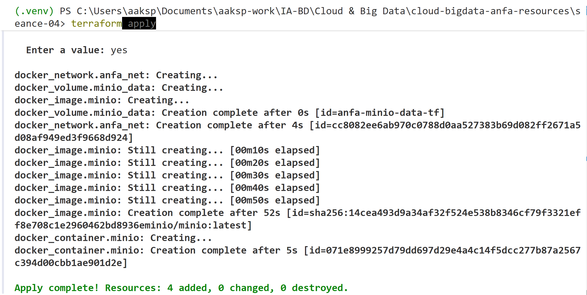
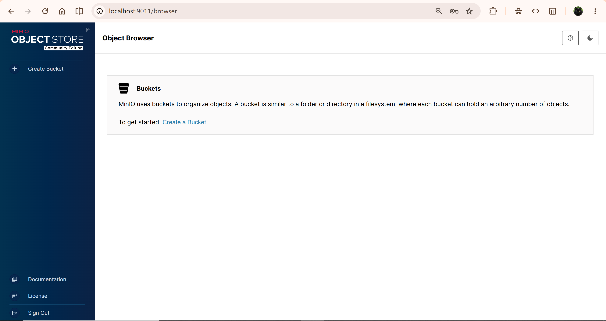
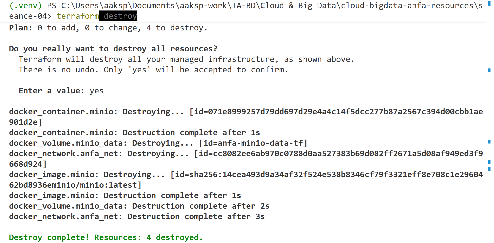

# Rendu — Séance 4

**Nom et prénom :** AHLI Kossi Sitsofe Pédro
**Identifiant GitHub :** aksp66
**Date de soumission :** 27/06/2026

## Résumé de la séance

Cette séance a permis de comprendre l'Infrastructure as Code (IaC) et ses 4 principes fondamentaux (déclaratif, idempotent, versionné, reproductible), ainsi que l'architecture de Terraform (providers, resources, state, workflow plan/apply/destroy) et sa place par rapport à OpenTofu et Ansible. Sur le plan pratique, j'ai installé Terraform, décrit en HCL une infrastructure Docker complète pour MinIO (réseau, volume, conteneur), maîtrisé le workflow `init` → `plan` → `apply` → `destroy`, observé concrètement le state et l'idempotence, puis refactorisé le code en variables et fichier `.tfvars` pour le rendre propre et réutilisable.

## Étapes principales

1. Installation de Terraform v1.15.7 et récupération des snippets du gist du cours.
2. Premier contact : `main.tf` minimal (image + conteneur MinIO), workflow `init` → `plan` → `apply` → `destroy`.
3. Recréation de l'infrastructure, observation du fichier `terraform.tfstate` (JSON, contient les secrets en clair) et test de l'idempotence (`apply` sans changement → `No changes`).
4. Mise en place du `.gitignore` spécifique Terraform (exclusion de `.terraform/`, `*.tfstate`, `*.tfvars`).
5. Stack complète : ajout du réseau `anfa-network` et du volume `anfa-minio-data-tf`, conteneur avec `restart = "unless-stopped"`.
6. Test du changement incrémental : modification du mot de passe MinIO → seul le conteneur est recréé (réseau et volume intacts, `Plan: 1 to add, 0 to change, 1 to destroy`).
7. Refactoring en `variables.tf`, `terraform.tfvars` (secret, gitignored) et `terraform.tfvars.example` (versionné) — plan revérifié comme strictement équivalent (`No changes`) une fois le mot de passe remis à sa valeur de référence.
8. Destruction finale propre de toute l'infrastructure (conteneur, réseau, volume) en une seule commande `terraform destroy`.

## Captures d'écran

### terraform plan (création initiale)



### terraform apply réussi



### Console MinIO créée par Terraform



### terraform destroy



## Réponses aux exercices d'application

### Exercice 1 : QCM conceptuel

**1.1** Réponse : **B.** (affirmation fausse) L'IaC remplace totalement la nécessité de comprendre l'infrastructure sous-jacente. C'est faux : l'IaC est un outil d'automatisation, pas un substitut à la compréhension de ce qu'on provisionne — il faut toujours savoir ce que fait une `resource` pour écrire un code correct et sûr.

**1.2** Réponse : **B.** Le déclaratif décrit l'état souhaité ; l'impératif décrit la séquence d'actions à effectuer.

**1.3** Réponse : **B.** Elle produit le même résultat quel que soit le nombre de fois où elle est appliquée — confirmé empiriquement dans ce TP (`terraform apply` répété sans changement → `No changes. Your infrastructure matches the configuration.`).

**1.4** Réponse : **B.** Un provider fournit un plugin qui sait communiquer avec une API spécifique (AWS, Docker, Kubernetes…) ; Terraform lui-même n'a aucune connaissance native de ces systèmes.

**1.5** Réponse : **B.** Terraform compare le state au code, ne voit aucun écart, et n'effectue aucune action. C'est exactement ce que j'ai observé en partie 3.3 du TP.

**1.6** Réponse : **C.** Le `terraform.tfstate` mémorise ce que Terraform a créé (IDs, attributs) pour pouvoir calculer les changements incrémentaux lors des `apply` suivants.

**1.7** Réponse : **B.** Il peut contenir des secrets en clair (vu dans ce TP : le mot de passe MinIO apparaît tel quel dans le JSON du state) et un commit concurrent peut le corrompre, d'où l'usage d'un remote backend en équipe.

**1.8** Réponse : **C.** `terraform plan` — il prévisualise les changements sans rien appliquer ; c'est le réflexe de sécurité avant tout `apply`.

**1.9** Réponse : **B.** Un fork open source de Terraform créé par la Linux Foundation après le passage de Terraform à la licence BSL en 2023.

**1.10** Réponse : **B.** Non : Terraform provisionne l'infrastructure (créer une VM, un réseau), Ansible configure des machines déjà existantes (installer des paquets) — ils sont complémentaires, pas concurrents.

### Exercice 2 : Lecture et interprétation d'un fichier Terraform

**2.1 — Les 4 resources :**

- `docker_network.back` : crée un réseau Docker nommé `anfa-backend` pour isoler/connecter les conteneurs du projet.
- `docker_volume.data` : crée un volume Docker nommé `postgres-data` pour persister les données de Postgres au-delà de la vie du conteneur.
- `docker_image.postgres` : référence (télécharge si besoin) l'image `postgres:15` localement.
- `docker_container.db` : crée et démarre le conteneur Postgres (`anfa-postgres`), configuré avec les variables d'environnement, le port 5432, le volume monté sur `/var/lib/postgresql/data`, et attaché au réseau `back`.

**2.2 — `docker_image.postgres.image_id` :** c'est une référence à l'attribut `image_id` calculé par Terraform une fois la resource `docker_image.postgres` résolue — l'ID/digest réel de l'image téléchargée. Par rapport à écrire `image = "postgres:15"` en dur, cette référence :

- crée une dépendance explicite : Terraform sait qu'il doit créer/résoudre l'image avant le conteneur ;
- garantit que le conteneur utilise exactement l'image vérifiée par Terraform (un digest immuable), plutôt qu'un tag mutable qui pourrait pointer vers une version différente entre le `plan` et l'`apply` ;
- permet à Terraform de détecter un changement réel d'image (et donc de recréer le conteneur si nécessaire), ce qu'un tag statique en dur ne déclencherait pas.

**2.3 — Ordre de création :** Terraform construit un graphe de dépendances à partir des références entre resources, puis crée selon un ordre topologique :

1. `docker_network.back`, `docker_volume.data` et `docker_image.postgres` — aucune dépendance entre elles, donc créées en parallèle.
2. `docker_container.db` en dernier, car il référence les trois resources précédentes (`image_id`, `volume_name`, `name` du réseau) : Terraform doit attendre qu'elles existent avant de pouvoir créer le conteneur.

**2.4 — Problème de sécurité et correction :** le mot de passe Postgres (`secret123`) est écrit en clair, en dur, dans un fichier `.tf` versionné dans Git — toute personne ayant accès au dépôt (et à son historique) le voit.

```hcl
variable "postgres_password" {
  type      = string
  sensitive = true
}

resource "docker_container" "db" {
  # ...
  env = [
    "POSTGRES_DB=anfa",
    "POSTGRES_USER=anfa_user",
    "POSTGRES_PASSWORD=${var.postgres_password}",
  ]
}
```

La valeur réelle serait fournie via un `terraform.tfvars` non versionné, exactement comme `minio_root_password` dans ce TP.

**2.5 —** `terraform destroy` supprime toutes les resources gérées (réseau, volume, image, conteneur), donc le state se retrouve vide. Modifier `external = 5432` en `5433` puis relancer `terraform apply` ne déclenche pas un « changement incrémental » : comme il n'y a plus rien dans le state, Terraform doit **tout recréer depuis zéro** (réseau, volume, image, conteneur avec le nouveau port). Le volume `data` étant lui aussi recréé (nouveau volume vide), **les données précédentes de Postgres sont perdues** — le `destroy` les a explicitement supprimées avant la modification.

### Exercice 3 : Diagnostic

#### 3.1 — Dépendance circulaire

a. Terraform a détecté un **cycle** dans le graphe de dépendances : `docker_container.a` référence `docker_container.b.name`, et `docker_container.b` référence en retour `docker_container.a.name`.

b. Terraform refuse parce que son modèle d'exécution repose sur un graphe orienté **acyclique** (DAG) : il doit pouvoir trier les resources par ordre de dépendance pour décider quoi créer en premier. Avec un cycle, aucun ordre valide n'existe — chaque conteneur a besoin d'une valeur connue seulement après la création de l'autre.

c. Solution : casser la dépendance circulaire en utilisant des noms littéraux (déjà connus statiquement) plutôt que des références Terraform :

```hcl
resource "docker_container" "a" {
  name  = "container-a"
  image = "alpine"
  env   = ["LINKED_TO=container-b"]
}

resource "docker_container" "b" {
  name  = "container-b"
  image = "alpine"
  env   = ["LINKED_TO=container-a"]
}
```

#### 3.2 — Le plan qui veut tout recréer

a. Terraform marque le conteneur `-/+` parce que le provider `kreuzwerker/docker` traite le bloc `env` comme un attribut qui force le remplacement (« ForceNew ») : Docker ne permet pas de modifier les variables d'environnement d'un conteneur déjà créé sans le recréer entièrement.

b. Cela dépend de l'architecture : si le volume est une `resource docker_volume` **séparée** (comme `anfa-minio-data-tf` dans ce TP), il survit à la destruction du conteneur — seul le conteneur est recréé, les données sont préservées. Si en revanche c'est un volume anonyme lié au cycle de vie du conteneur, les données seraient perdues. Dans notre `main.tf`, le volume étant une resource indépendante, **les données survivent**.

c. Non, ce n'est pas « gratuit » en production : recréer le conteneur implique une **coupure de service** pendant la destruction puis la recréation (requêtes en échec, connexions actives coupées, redémarrage des health checks). C'est pour cela qu'on planifie ces changements dans une fenêtre de maintenance plutôt que de les appliquer sans précaution.

#### 3.3 — Le state corrompu

a. Problème de sécurité immédiat : `terraform.tfstate` contient en clair toutes les valeurs sensibles (mots de passe, clés). En le poussant sur GitHub, ces secrets sont exposés publiquement (ou à tous les collaborateurs du dépôt), et restent dans l'historique Git même après suppression du fichier.

b. Risque pour Awa : son `terraform apply` va comparer le state téléchargé (qui décrit l'infrastructure de la machine de l'étudiant, avec ses IDs Docker) à sa propre machine, où ces resources n'existent pas. Terraform peut alors échouer (« resource not found »), tenter d'agir sur des IDs invalides, ou produire un résultat incohérent qui ne correspond à rien de réel chez elle.

c. Solution pérenne : utiliser un **remote backend** partagé (Terraform Cloud, S3 + verrouillage, etc.) plutôt que le state local. Le state vit alors dans un stockage centralisé, jamais dans Git, avec verrouillage empêchant les applications concurrentes et un accès contrôlé.

### Exercice 4 : Adaptation Compose → Terraform

```hcl
terraform {
  required_providers {
    docker = {
      source  = "kreuzwerker/docker"
      version = "~> 3.0"
    }
  }
}

provider "docker" {}

variable "minio_root_password" {
  description = "Mot de passe administrateur MinIO"
  type        = string
  sensitive   = true
}

# Réseau partagé : équivalent du réseau implicite créé par Compose
resource "docker_network" "anfa_net" {
  name = "anfa-network"
}

# Volume pour les données MinIO
resource "docker_volume" "minio_data" {
  name = "minio-data"
}

resource "docker_image" "minio" {
  name = "minio/minio:latest"
}

resource "docker_container" "minio" {
  name    = "anfa-minio"
  image   = docker_image.minio.image_id
  command = ["server", "/data", "--console-address", ":9001"]

  ports {
    internal = 9000
    external = 9000
  }
  ports {
    internal = 9001
    external = 9001
  }

  env = [
    "MINIO_ROOT_USER=anfa-admin",
    "MINIO_ROOT_PASSWORD=${var.minio_root_password}",
  ]

  volumes {
    volume_name    = docker_volume.minio_data.name
    container_path = "/data"
  }

  networks_advanced {
    name = docker_network.anfa_net.name
  }

  lifecycle {
    ignore_changes = [log_opts]
  }
}

resource "docker_image" "jupyter" {
  name = "jupyter/scipy-notebook:latest"
}

resource "docker_container" "jupyter" {
  name  = "anfa-jupyter"
  image = docker_image.jupyter.image_id

  ports {
    internal = 8888
    external = 8888
  }

  env = [
    "JUPYTER_TOKEN=anfa-token",
  ]

  # Référencer le réseau créé par Terraform suffit à garantir son existence
  # avant ce conteneur — pas besoin de reproduire depends_on.
  networks_advanced {
    name = docker_network.anfa_net.name
  }

  lifecycle {
    ignore_changes = [log_opts]
  }
}
```

### Exercice 5 : Mini-cas d'architecture

**5.1 — Au moins 4 types de resources :**

1. Un **bucket de stockage objet** (CSV du référentiel, futurs logs GPS — hébergé chez OVHcloud pour la souveraineté des données).
2. Un **cluster Kubernetes managé** (pour héberger les traitements Spark avec autoscaling, élastique aux heures de pointe).
3. Un **réseau privé / VPC** pour isoler les communications entre composants.
4. Un **load balancer / passerelle publique** pour exposer le dashboard Grafana de façon sécurisée depuis n'importe quel téléphone.
5. *(bonus)* Des règles de pare-feu et un utilisateur de service avec des clés d'accès limitées.

**5.2 —** Je recommande l'option **B** (fichiers séparés : `network.tf`, `storage.tf`, `compute.tf`, `monitoring.tf`). Un seul fichier de 800 lignes devient illisible et rend les revues de code difficiles (un changement de stockage se noie dans un diff énorme) ; séparer par domaine fonctionnel facilite la lecture, la collaboration entre plusieurs personnes sans conflits de merge, et la maintenance — Terraform charge de toute façon tous les `.tf` d'un dossier comme un seul module, donc ce découpage n'a aucun coût technique, seulement des bénéfices organisationnels.

**5.3 —** Deux mécanismes Terraform pour gérer dev/prod avec la même définition :

1. Des **fichiers de variables différents** (`terraform.dev.tfvars` / `terraform.prod.tfvars`) appliqués via `terraform apply -var-file=...`.
2. Des **workspaces Terraform** (`terraform workspace new dev`/`prod`), qui maintiennent des states distincts pour une même configuration.

**5.4 —** La migration ne sera pas triviale, mais elle sera largement facilitée par le fait que tout est déjà décrit en Terraform. Ce qui se transpose facilement : la structure logique (resources, variables, dépendances, organisation en fichiers) et la méthodologie (workflow `plan`/`apply`, gestion des secrets via variables) restent identiques quel que soit le fournisseur. Ce qui demandera du travail : chaque resource doit être réécrite avec le provider AWS (noms et arguments spécifiques à chaque fournisseur), il faudra migrer les données elles-mêmes (buckets, volumes), réauthentifier le provider, et tester soigneusement les différences de comportement réseau et de quotas. À estimer en jours/semaines selon la taille de l'infra — pas instantané, mais infiniment plus rapide qu'une reconfiguration manuelle complète.

**5.5 —** Trois bonnes pratiques pour une équipe de 4 personnes :

1. **Remote backend partagé** (Terraform Cloud, S3 + verrouillage) pour le state, avec accès contrôlé — évite les conflits et la corruption vus à l'exercice 3.3.
2. **Revue de code obligatoire** (pull request avec le `terraform plan` visible) avant tout merge vers la branche de production, pour qu'aucun `apply` n'arrive sans validation par un pair.
3. **Convention de structuration claire** des fichiers (comme en 5.2) et `.gitignore` strict pour ne jamais committer de secrets ou de state, afin que tout le monde travaille de la même façon sans risque d'exposition.

## Difficultés rencontrées

- Le plan de la Partie 4 (ajout du réseau et du volume) a proposé de **recréer** le conteneur (`-/+`) plutôt que de le modifier en place (`~`) comme annoncé dans le TP — l'ajout d'un bloc `volumes` à un conteneur qui n'en avait pas force un remplacement avec la version du provider `kreuzwerker/docker` utilisée (v3.9.0). Comportement sans impact sur la compréhension du TP : le réseau et le volume eux n'étaient pas affectés, seul le conteneur a été recréé.
- Après le test du changement incrémental (Partie 4.4) puis le passage aux variables (Partie 5), le premier `terraform plan` avec `terraform.tfvars` a affiché un changement attendu : il s'agissait simplement du mot de passe revenant de `nouveau-mot-de-passe-2026` (valeur de test) à `anfa-password-2026` (valeur de référence dans le `.tfvars`) — pas une anomalie de la paramétrisation.
