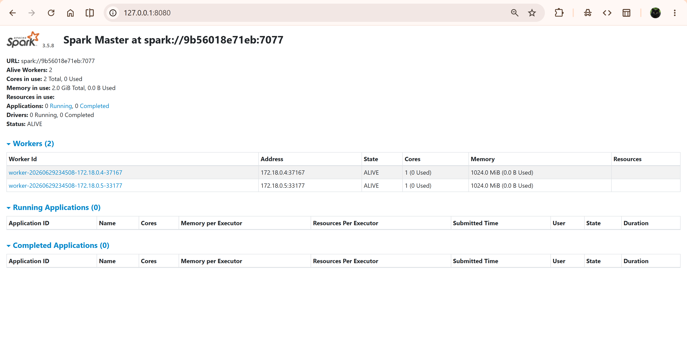
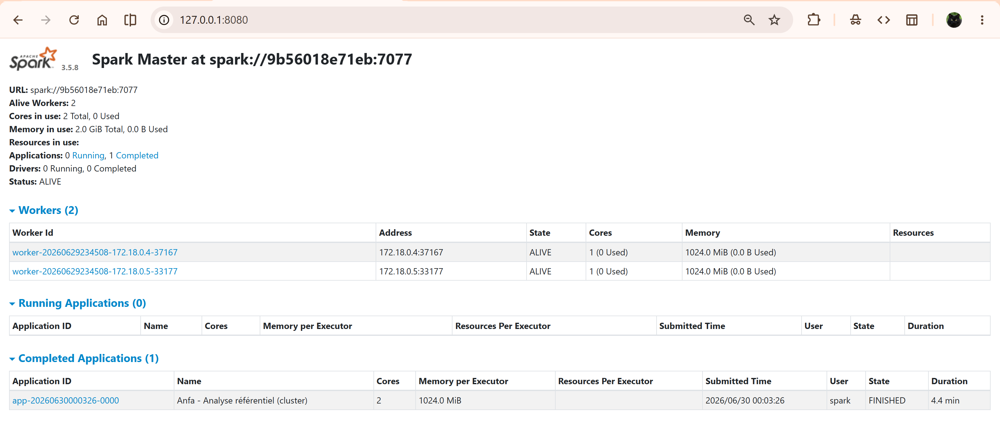
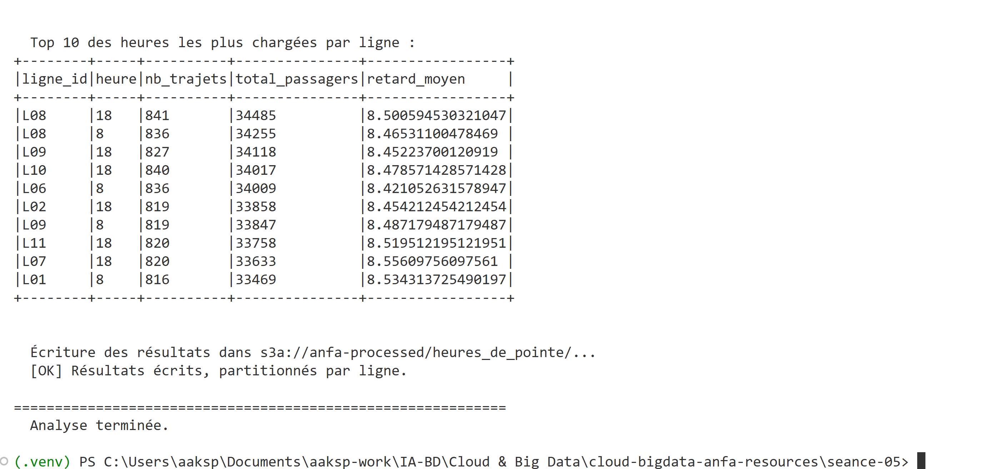
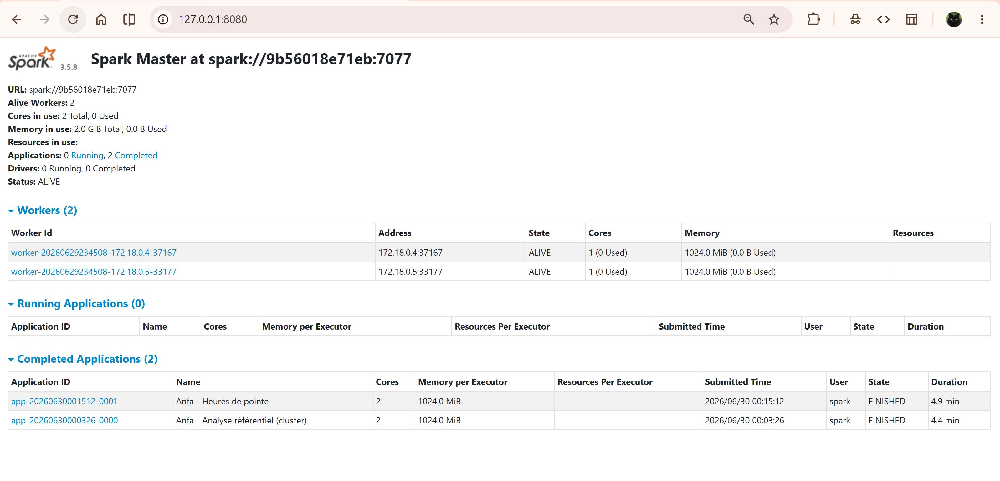
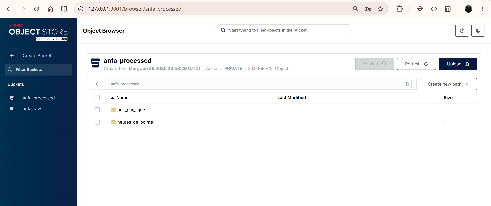

# Séance 5 — Apache Spark : cluster distribué sur Docker Compose

**Étudiant :** AHLI Kossi Sitsofe Pédro  
**Formation :** Master 1 IA/BD — ESGIS  
**Cours :** Cloud & Big Data — Denis AKPAGNONITE  
**Date :** 2026-06-30

---

## 1. Résumé du cours magistral

### Architecture Apache Spark

Apache Spark est un moteur de traitement distribué en mémoire. Il repose sur trois composants fondamentaux :

| Composant | Rôle |
| --- | --- |
| **Driver** | Orchestre le job : interprète le code PySpark, construit le DAG (graphe des tâches), soumet les stages aux executors |
| **Cluster Manager** | Gère les ressources du cluster et alloue les executors aux applications (Standalone, YARN, Kubernetes) |
| **Executors** | Processus JVM sur les nœuds workers : exécutent les tâches, lisent/écrivent les données, gardent les partitions en mémoire |

### Modes de déploiement

- **Local** (`.master("local[*]")`) : driver + executor dans le même processus sur la machine locale. Simple, sans réseau distribué.
- **Standalone** : cluster Spark natif avec un master et des workers. Utilisé dans ce TP.
- **YARN / Kubernetes** : intégration dans des orchestrateurs d'entreprise pour des clusters partagés.

### RDD, DataFrame, Spark SQL

Spark modélise les données en **partitions** réparties sur les executors. Les DataFrames (API haut niveau) permettent des optimisations automatiques via le **Catalyst Optimizer**. Un `groupBy()` provoque un **shuffle** : redistribution des données entre les executors sur le réseau — opération coûteuse.

### Format Parquet et Data Lake

- Parquet est un format **colonnaire** : lecture sélective des colonnes, compression efficace, adapté aux analyses.
- Le partitionnement physique (`partitionBy("ligne_id")`) permet à Spark de ne lire que les partitions pertinentes (partition pruning), réduisant drastiquement les I/O.
- Architecture Data Lake utilisée : `anfa-raw` (données brutes CSV) → `anfa-processed` (données traitées Parquet).

---

## 2. Ce qui a été réalisé

### Partie 0 — Synchronisation du fork

```bash
git fetch upstream
git checkout upstream/main -- seance-05/docker-compose.yml seance-05/jobs/
```

Récupération des fichiers fournis par le prof depuis le dépôt upstream.

### Partie 1 — Déploiement du cluster Spark

```bash
cd seance-05
docker compose up -d
docker compose ps
```

**4 services lancés :**

| Conteneur | Image | Ports |
| --- | --- | --- |
| `anfa-minio` | `minio/minio:latest` | 9000, 9001 |
| `anfa-spark-master` | `apache/spark:3.5.8-python3` | 7077 (jobs), 8080 (UI) |
| `anfa-spark-worker-1` | `apache/spark:3.5.8-python3` | 8081 |
| `anfa-spark-worker-2` | `apache/spark:3.5.8-python3` | 8082 |



Les 2 workers apparaissent **ALIVE** dans l'UI, chacun avec 1G RAM et 1 core.

### Partie 2 — Préparation de MinIO

```bash
# Alias mc
docker exec anfa-minio mc alias set local http://localhost:9000 anfa-admin anfa-password-2026

# Création des buckets
docker exec anfa-minio mc mb local/anfa-raw
docker exec anfa-minio mc mb local/anfa-processed

# Compte de service applicatif
docker exec anfa-minio mc admin user svcacct add local anfa-admin \
    --access-key "anfa-app-key" \
    --secret-key "anfa-app-secret-2026"

# Installation de boto3 dans le conteneur spark-master
docker exec -e HOME=/tmp anfa-spark-master pip install boto3 --quiet

# Upload du référentiel
docker exec -e HOME=/tmp anfa-spark-master python3 /opt/jobs/upload_referentiel.py
```

Sortie :

```text
[OK] arrets.csv → s3://anfa-raw/referentiel/arrets.csv
[OK] bus.csv → s3://anfa-raw/referentiel/bus.csv
[OK] lignes.csv → s3://anfa-raw/referentiel/lignes.csv
[OK] tarifs.csv → s3://anfa-raw/referentiel/tarifs.csv
```

### Partie 3 — Premier job Spark distribué

```bash
docker exec -e HOME=/tmp anfa-spark-master /opt/spark/bin/spark-submit \
  --master spark://spark-master:7077 \
  --conf spark.jars.ivy=/tmp/.ivy2 \
  --packages "org.apache.hadoop:hadoop-aws:3.3.4,com.amazonaws:aws-java-sdk-bundle:1.12.262" \
  /opt/jobs/analyse_referentiel_cluster.py
```

Le job lit les 4 CSV depuis `s3a://anfa-raw/referentiel/`, calcule les statistiques de la flotte et écrit les résultats en Parquet dans `s3a://anfa-processed/bus_par_ligne`.



### Partie 4 — Génération des trajets et heures de pointe

**Génération :**

```bash
docker exec -e HOME=/tmp anfa-spark-master python3 /opt/jobs/generer_trajets.py
```

Génère 30 jours de trajets simulés (~75 000 lignes) et les stocke dans `s3a://anfa-raw/trajets/trajets_30j.csv`.

**Analyse des heures de pointe :**

```bash
docker exec -e HOME=/tmp anfa-spark-master /opt/spark/bin/spark-submit \
  --master spark://spark-master:7077 \
  --conf spark.jars.ivy=/tmp/.ivy2 \
  --packages "org.apache.hadoop:hadoop-aws:3.3.4,com.amazonaws:aws-java-sdk-bundle:1.12.262" \
  /opt/jobs/heures_de_pointe.py
```

Le job agrège les trajets par `(ligne_id, heure)`, affiche le Top 10 et écrit les résultats partitionnés par `ligne_id` dans `s3a://anfa-processed/heures_de_pointe`.







### Partie 7 — Arrêt de la stack

```bash
docker compose down
```

---

## 3. Exercices

### 3.1 — Rôles dans l'architecture Spark

**Driver** : interprète le programme PySpark, construit le plan d'exécution (DAG), divise le travail en stages et tasks, et les envoie aux executors via le Cluster Manager.

**Cluster Manager** : en mode Standalone, c'est le spark-master. Il décide quels workers reçoivent les executors et combien de ressources chacun obtient.

**Executors** : processus JVM lancés sur les workers. Ils exécutent concrètement les tâches (lecture, transformation, écriture), gardent les données en mémoire entre les stages.

### 3.2 — `.master("spark://spark-master:7077")` vs `.master("local[*]")`

| Mode | Signification |
| --- | --- |
| `local[*]` | Spark tourne dans un seul processus sur la machine locale, avec autant de threads que de cœurs disponibles. Pas de réseau distribué. |
| `spark://spark-master:7077` | Spark se connecte au master du cluster. Les executors tournent sur les workers (anfa-spark-worker-1 et 2). Le travail est vraiment distribué. |

En mode cluster, `spark-master` est résolu par le DNS interne de Docker Compose.

### 3.3 — Pourquoi `HOME=/tmp` et `spark.jars.ivy=/tmp/.ivy2`

L'image `apache/spark` fait tourner les processus avec un utilisateur sans répertoire home (`/nonexistent`). Pip et Ivy (le gestionnaire de dépendances Maven de Spark) ont besoin d'écrire dans le répertoire home de l'utilisateur.

En forçant `HOME=/tmp`, on redirige ces écritures vers `/tmp` qui est accessible en écriture. Sans cette configuration, `pip install` échoue avec une erreur de permissions, et `spark-submit --packages` ne peut pas télécharger les JARs.

### 3.4 — Le connecteur S3A

S3A est une implémentation du système de fichiers Hadoop qui permet à Spark de lire/écrire sur n'importe quel stockage compatible S3 (Amazon S3, MinIO, etc.). La configuration nécessaire :

```python
.config("spark.hadoop.fs.s3a.endpoint", "http://minio:9000")    # adresse MinIO
.config("spark.hadoop.fs.s3a.access.key", "anfa-app-key")
.config("spark.hadoop.fs.s3a.secret.key", "anfa-app-secret-2026")
.config("spark.hadoop.fs.s3a.path.style.access", "true")         # MinIO n'utilise pas de virtual-hosted style
.config("spark.hadoop.fs.s3a.connection.ssl.enabled", "false")   # pas de TLS en local
```

Les JARs Maven `hadoop-aws` et `aws-java-sdk-bundle` fournissent les classes nécessaires, téléchargées automatiquement par `--packages`.

### 3.5 — Coût du shuffle et `groupBy()`

Un `groupBy()` nécessite de regrouper toutes les lignes ayant la même clé sur le même executor. Comme les données sont initialement réparties aléatoirement entre partitions, Spark doit réorganiser et transférer des données entre tous les executors — c'est le **shuffle** (redistribution réseau).

Dans `heures_de_pointe.py`, le `groupBy("ligne_id", "heure")` redistribue ~75 000 lignes entre les 2 workers. Sur un vrai cluster avec des téraoctets de données, le shuffle est le principal goulot d'étranglement de performance.

### 3.6 — Parquet et partitionnement

**Parquet** est un format colonnaire : les valeurs d'une même colonne sont stockées ensemble, ce qui permet :

- De ne lire que les colonnes nécessaires à la requête (column pruning)
- Une meilleure compression (valeurs similaires côte à côte)
- Des stats de colonne (min/max) pour filtrer les blocs sans les lire

**Partitionnement physique** (`partitionBy("ligne_id")`) crée un sous-répertoire par valeur de `ligne_id` :

```text
heures_de_pointe/
  ligne_id=L01/part-*.parquet
  ligne_id=L02/part-*.parquet
  ...
  ligne_id=L12/part-*.parquet
```

Si une requête filtre sur `WHERE ligne_id = 'L01'`, Spark ne lit que le sous-répertoire `ligne_id=L01` — aucun accès aux 11 autres partitions.

### 3.7 — Comparaison mode local vs mode cluster

| Critère | Local (`local[*]`) | Cluster Standalone |
| --- | --- | --- |
| Déploiement | Aucun — juste Python/PySpark | Cluster à déployer (Compose, YARN, K8s…) |
| Parallélisme | Threads sur 1 machine | Processus réels sur plusieurs nœuds |
| Tolérance aux pannes | Aucune | Resubmission automatique des tasks |
| Configuration S3A | Identique | Identique (endpoint seul change si externe) |
| Cas d'usage | Développement, debug, petites données | Production, données > RAM d'une machine |
| Observabilité | UI Spark basique | UI complète avec historique des stages |

En pratique, on développe en local et on bascule sur le cluster en changeant une seule ligne : `.master("local[*]")` → `.master("spark://master:7077")`.

---

## 4. Difficultés rencontrées

### 4.1 — Absence de répertoire home dans l'image apache/spark

**Symptôme :** `pip install boto3` échoue avec `Permission denied: '/nonexistent'`, et `spark-submit --packages` échoue pour la même raison côté Ivy.

**Cause :** L'utilisateur du conteneur `apache/spark` n'a pas de répertoire home valide.

**Solution :** Passer `HOME=/tmp` comme variable d'environnement à toutes les commandes `docker exec` qui en ont besoin, et ajouter `--conf spark.jars.ivy=/tmp/.ivy2` à spark-submit.

### 4.2 — boto3 non inclus dans l'image Spark

**Symptôme :** `ModuleNotFoundError: No module named 'boto3'` à l'exécution de `upload_referentiel.py`.

**Cause :** L'image `apache/spark:3.5.8-python3` inclut Python et PySpark, mais pas boto3 (bibliothèque AWS/S3 pour Python pur).

**Solution :** Installer boto3 manuellement avec `docker exec -e HOME=/tmp anfa-spark-master pip install boto3 --quiet`. Cette installation est éphémère : si le conteneur est recréé, il faut la refaire. En production, on étendrait l'image avec un `Dockerfile`.

### 4.3 — Résolution DNS `minio` depuis les conteneurs Spark

Les scripts pointent vers `http://minio:9000`, ce qui fonctionne grâce au réseau Docker Compose qui crée automatiquement un réseau commun entre tous les services. De l'hôte, l'endpoint serait `http://localhost:9000`.
