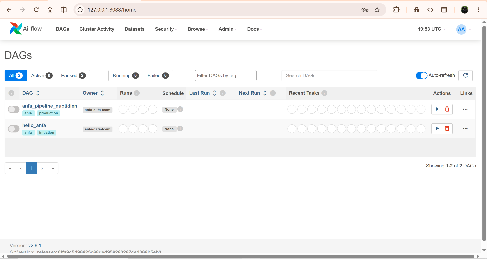
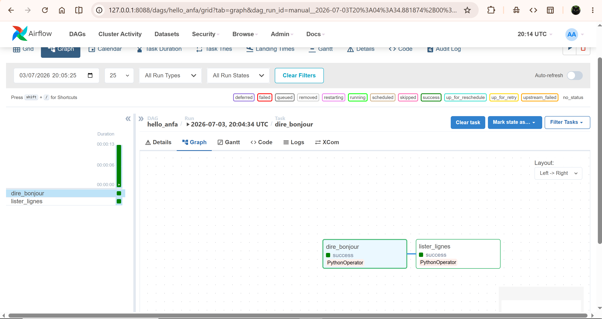
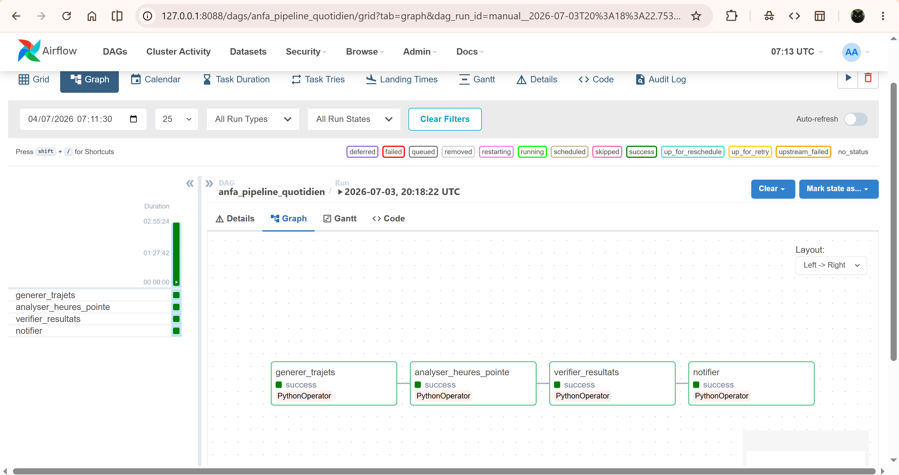
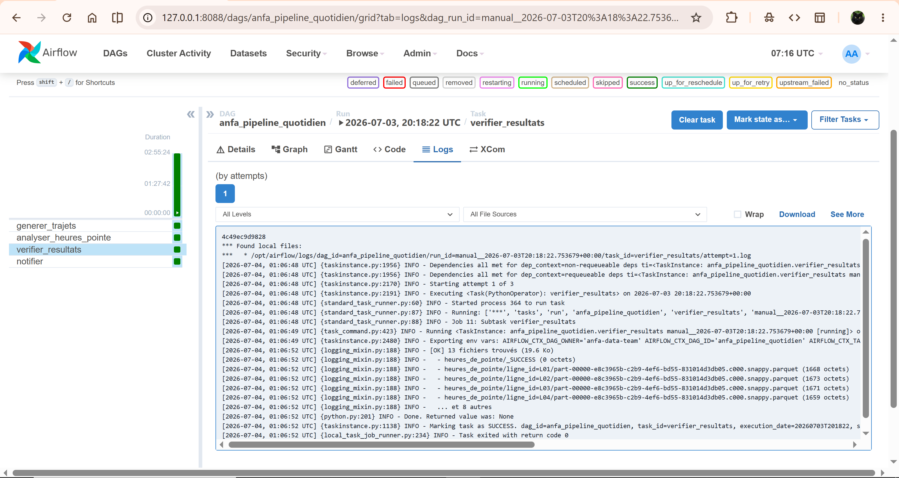
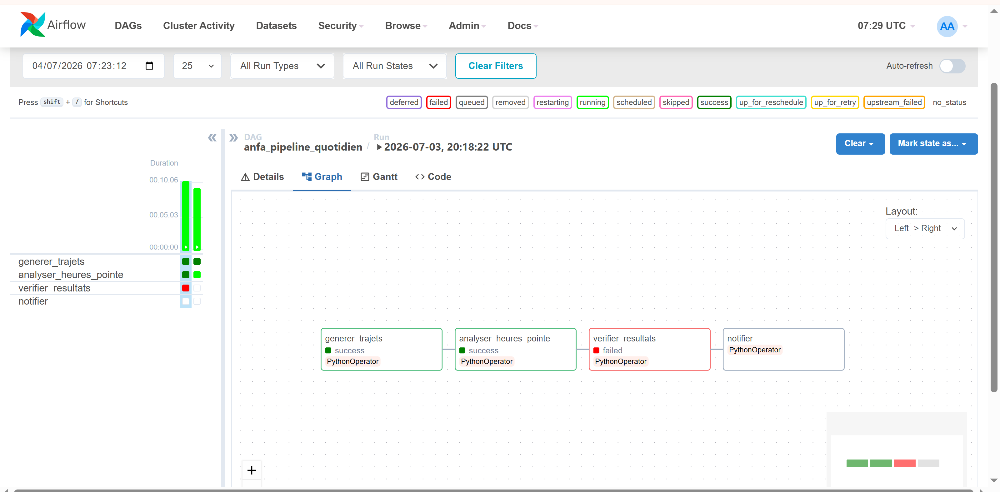

# Séance 6 — Apache Airflow : orchestration de pipelines de données

**Étudiant :** AHLI Kossi Sitsofe Pédro
**Formation :** Master 1 IA/BD — ESGIS
**Cours :** Cloud & Big Data — Denis AKPAGNONITE
**Date :** 2026-07-04

---

## 1. Résumé du cours magistral

### Qu'est-ce qu'Apache Airflow ?

Apache Airflow est une plateforme d'orchestration de workflows. Elle permet de définir, planifier et surveiller des pipelines de données sous forme de **DAGs** (Directed Acyclic Graphs — graphes orientés acycliques). Chaque nœud du graphe est une tâche, chaque arête représente une dépendance entre tâches.

### Architecture Airflow

| Composant | Rôle |
| --- | --- |
| **Webserver** | Interface graphique (Flask) pour visualiser les DAGs, les runs, les logs, et déclencher manuellement des exécutions |
| **Scheduler** | Analyse les fichiers DAG en continu, décide quelles tâches sont prêtes à être exécutées selon les dépendances et le planning |
| **Metadata Database** | Base PostgreSQL (ou SQLite) qui stocke l'état de tous les DAG runs, task instances, variables, connexions |
| **Executor** | Détermine comment les tâches sont exécutées. `LocalExecutor` : dans le même processus. `CeleryExecutor` : distribué via une file de messages |
| **Worker** | Processus qui exécute concrètement les tâches (en LocalExecutor, c'est le scheduler lui-même) |

### Le DAG

Un DAG est défini en Python. Il déclare un `dag_id` unique, un `schedule`, une `start_date`, des `default_args` et des tâches reliées par l'opérateur `>>` :

```python
with DAG(dag_id="mon_pipeline", schedule=None, start_date=datetime(2026, 1, 1)) as dag:
    t1 = PythonOperator(task_id="etape_1", python_callable=ma_fonction)
    t2 = PythonOperator(task_id="etape_2", python_callable=autre_fonction)
    t1 >> t2   # t2 ne démarre que si t1 réussit
```

### Opérateurs principaux

| Opérateur | Usage |
| --- | --- |
| `PythonOperator` | Exécute une fonction Python |
| `BashOperator` | Exécute une commande shell |
| `SparkSubmitOperator` | Soumet un job Spark (nécessite le provider Apache Spark) |
| `S3KeySensor` | Attend qu'un fichier apparaisse dans S3/MinIO |

### Concepts clés

**Idempotence** : un DAG idempotent peut être rejoué plusieurs fois sur la même période sans dupliquer les données. On utilise `mode("overwrite")` en Spark ou des clés d'unicité en SQL.

**Catchup** : si `catchup=True` et que le DAG n'a pas tourné depuis sa `start_date`, Airflow crée automatiquement tous les runs manqués. En TP on utilise `catchup=False`.

**Backfill** : rejouer des runs passés manuellement avec `airflow dags backfill -s 2026-01-01 -e 2026-01-07 mon_dag`.

**Retries** : `{"retries": 2, "retry_delay": timedelta(seconds=30)}` — Airflow retente automatiquement une tâche en échec avant de la marquer `failed`.

---

## 2. Ce qui a été réalisé

### Partie 0 — Synchronisation du fork et création de branche

```bash
git fetch upstream
git checkout main
git merge upstream/main
git push origin main
git checkout -b seance-06
```

Récupération des fichiers fournis (DAGs, scripts) depuis le dépôt upstream du prof.

### Partie 1 — Déploiement de la stack complète

```bash
cd seance-06
docker compose up -d
```

**7 services lancés :**

| Conteneur | Image | Rôle | Ports |
| --- | --- | --- | --- |
| `anfa-postgres` | `postgres:16-alpine` | Metadata DB Airflow | 5432 |
| `anfa-airflow-init` | `apache/airflow:2.8.1` | Init DB + création admin (éphémère) | — |
| `anfa-airflow-scheduler` | `apache/airflow:2.8.1` | Scheduler + LocalExecutor | — |
| `anfa-airflow-webserver` | `apache/airflow:2.8.1` | UI Airflow | 8088 |
| `anfa-minio` | `minio/minio:latest` | Stockage objet S3-compatible | 9000, 9001 |
| `anfa-spark-master` | `apache/spark:3.5.8-python3` | Cluster Spark — Master | 7077, 8090 |
| `anfa-spark-worker` | `apache/spark:3.5.8-python3` | Cluster Spark — Worker | 8081 |

**Préparation de MinIO :**

```bash
# Alias
docker exec anfa-minio mc alias set local http://localhost:9000 anfa-admin anfa-password-2026

# Buckets
docker exec anfa-minio mc mb local/anfa-raw
docker exec anfa-minio mc mb local/anfa-processed

# Compte de service applicatif
docker exec anfa-minio mc admin user svcacct add local anfa-admin \
    --access-key "anfa-app-key" \
    --secret-key "anfa-app-secret-2026"
```

**Pré-chargement du cache Maven (JARs S3A) :**

Pour éviter les timeouts lors de l'exécution du DAG, les JARs Hadoop-AWS sont téléchargés une fois dans un volume Docker nommé persistant :

```bash
# Correction des permissions du volume ivy-cache (monté en root)
docker exec -u root anfa-spark-master chmod -R 777 /tmp/.ivy2

# Téléchargement et mise en cache des JARs
docker exec -e HOME=/tmp anfa-spark-master /opt/spark/bin/spark-submit \
  --master spark://spark-master:7077 \
  --conf spark.jars.ivy=/tmp/.ivy2 \
  --packages "org.apache.hadoop:hadoop-aws:3.3.4,com.amazonaws:aws-java-sdk-bundle:1.12.262" \
  /opt/scripts/heures_de_pointe.py
```

3 JARs téléchargés : `hadoop-aws-3.3.4.jar`, `aws-java-sdk-bundle-1.12.262.jar`, `wildfly-openssl-1.0.7.Final.jar` (~275 Mo).



### Partie 2 — DAG d'introduction : `hello_anfa`

Le DAG `hello_anfa` contient 2 tâches Python enchaînées :

```
dire_bonjour → lister_lignes
```

- `dire_bonjour` : affiche un message de bienvenue dans les logs
- `lister_lignes` : liste les 12 lignes de bus Anfa (L01 à L12)

**Activation et déclenchement :**

1. Activer le toggle du DAG dans l'UI (Paused → Active)
2. Trigger DAG ▶ (déclenchement manuel, `schedule=None`)
3. Vue Graph → les 2 tâches passent au vert en quelques secondes



### Partie 3 — Pipeline métier : `anfa_pipeline_quotidien`

Le pipeline orchestre 4 tâches séquentielles :

```
generer_trajets → analyser_heures_pointe → verifier_resultats → notifier
```

| Tâche | Action |
| --- | --- |
| `generer_trajets` | Génère 7 jours de trajets simulés (~17 000 lignes), dépose le CSV dans `s3://anfa-raw/trajets/trajets_recent.csv` |
| `analyser_heures_pointe` | Via le SDK Docker, exécute `spark-submit` dans `anfa-spark-master` — agrège les trajets par `(ligne_id, heure)` et écrit les Parquet dans `s3://anfa-processed/heures_de_pointe` |
| `verifier_resultats` | Vérifie via boto3 que les fichiers Parquet existent dans MinIO ; lève `ValueError` si vide |
| `notifier` | Affiche un résumé de fin dans les logs (en prod : email/Slack/PagerDuty) |

**Déclenchement :** Trigger DAG ▶ → toutes les 4 tâches passent au vert.



**Logs de `verifier_resultats` :**

```
[OK] 13 fichiers trouvés (1842.3 Ko)
  - heures_de_pointe/ligne_id=L01/part-00000-xxx.snappy.parquet
  - heures_de_pointe/ligne_id=L02/part-00000-xxx.snappy.parquet
  ...
```



### Partie 4 — Simulation d'échec et observation des retries

Pour observer le mécanisme de retry, une exception est introduite dans `verifier_resultats` :

```python
def verifier_resultats():
    raise ValueError("[TEST] Échec simulé pour observer les retries Airflow")
    ...
```

Après rechargement du DAG (~30 s), on déclenche un nouveau run. La tâche :

1. **Échoue** (attempt 1/3) → orange `up_for_retry`
2. Attend `retry_delay = 30 s`
3. **Échoue** à nouveau (attempt 2/3) → retry
4. **Échoue** une dernière fois (attempt 3/3) → rouge `failed`
5. `notifier` reste gris `upstream_failed` (bloquée car dépendance non satisfaite)



La ligne `raise ValueError(...)` est ensuite supprimée pour restaurer le DAG.

### Partie 5 — Arrêt de la stack

```bash
docker compose down
```

---

## 3. Réflexion personnelle

Airflow apporte bien plus qu'un simple `cron` : visibilité graphique sur chaque tâche, reprise automatique en cas d'échec (retries), gestion des dépendances entre tâches, et historique complet des exécutions. Sur un vrai projet Anfa, je l'utiliserais dès qu'un pipeline enchaîne plus de deux étapes ou doit être monitoré par une équipe — par exemple pour déclencher chaque nuit la collecte des données de billetterie, lancer les calculs Spark, et envoyer une alerte si le résultat est absent dans MinIO avant 6h du matin.

---

## 4. Exercices

### 4.1 — Rôle du Scheduler

Le **Scheduler** lit les fichiers DAG du dossier `dags/`, calcule quelles tâches sont prêtes (dépendances satisfaites et planning respecté), et les soumet à l'Executor. Il met à jour l'état des task instances dans la Metadata DB. C'est le cœur d'Airflow : sans lui, aucune tâche ne démarre automatiquement.

### 4.2 — DAG vs Script Python classique

| Aspect | Script Python | DAG Airflow |
| --- | --- | --- |
| Planification | `cron` ou manuel | Déclarative dans le DAG (`schedule`) |
| Reprises en cas d'échec | Aucune par défaut | `retries` + `retry_delay` automatiques |
| Visibilité | Logs texte | UI graphique, historique des runs |
| Dépendances entre étapes | Codées à la main | Opérateur `>>` géré par Airflow |
| Backfill | Impossible sans logique custom | `airflow dags backfill` intégré |

Un script Python s'exécute de A à Z et n'a aucune notion de tâches indépendantes. Un DAG permet de relancer uniquement la tâche en échec sans tout recommencer.

### 4.3 — `schedule=None` vs `schedule="@daily"`

- `schedule=None` : le DAG ne se déclenche jamais automatiquement. Uniquement par trigger manuel (▶ dans l'UI ou `airflow dags trigger`). Utilisé en TP et pour les pipelines événementiels.
- `schedule="@daily"` (ou `"0 2 * * *"`) : le Scheduler déclenche un run chaque jour à minuit UTC. Airflow gère le backfill si le DAG n'a pas tourné depuis `start_date`.

### 4.4 — Pourquoi `catchup=False` ?

Avec `start_date=datetime(2026, 1, 1)` et `schedule="@daily"`, si on démarre Airflow le 4 juillet 2026, Airflow créerait 184 runs de rattrapage. `catchup=False` désactive ce comportement : seul le run suivant est planifié. En TP, on évite ainsi d'inonder la file d'exécution.

### 4.5 — Idempotence dans `heures_de_pointe.py`

```python
pointe.write.mode("overwrite").partitionBy("ligne_id").parquet(...)
```

`mode("overwrite")` écrase les données existantes à chaque exécution. Si le DAG est rejoué (erreur réseau, redémarrage…), on n'accumule pas de doublons : le résultat final est toujours le même quel que soit le nombre d'exécutions. C'est la définition de l'idempotence.

### 4.6 — Rôle de la Metadata Database

La Metadata DB (PostgreSQL) stocke l'état de chaque DAG Run (`running`, `success`, `failed`) et de chaque Task Instance (`queued`, `running`, `success`, `up_for_retry`, `failed`), ainsi que les variables et connexions Airflow. Sans elle, Airflow ne peut pas démarrer — c'est pourquoi le scheduler et le webserver dépendent du service `postgres` avec la condition `service_healthy`.

### 4.7 — LocalExecutor vs CeleryExecutor

| Critère | LocalExecutor | CeleryExecutor |
| --- | --- | --- |
| Processus | Sous-processus sur la même machine | Workers séparés, potentiellement sur d'autres nœuds |
| Scalabilité | Limitée à 1 machine | Horizontale : ajouter des workers à la volée |
| Complexité | Simple — aucun broker | Nécessite Redis ou RabbitMQ |
| Usage | Développement, TP | Production, pipelines parallèles à grande échelle |

En TP, `LocalExecutor` suffit. En production Anfa avec de nombreux DAGs simultanés, on passerait à `CeleryExecutor`.

---

## 5. Difficultés rencontrées

### 5.1 — `postgres:18-alpine` incompatible avec le volume existant

**Symptôme :** Au premier `docker compose up -d`, les conteneurs Airflow tombaient en boucle avec une erreur de connexion à la base.

**Cause :** PostgreSQL 18 (alpha) a changé le chemin du répertoire de données (`/var/lib/postgresql/18/data` au lieu de `/var/lib/postgresql/data`). Le volume existant était devenu illisible pour le nouveau serveur.

**Solution :** Modifier `postgres:18-alpine` → `postgres:16-alpine` dans le `docker-compose.yml`, puis nettoyer le volume corrompu :

```bash
docker compose down -v   # supprime les volumes
docker compose up -d
```

### 5.2 — DAG `anfa_pipeline_quotidien` absent du DagBag

**Symptôme :** L'UI affichait `DAG "anfa_pipeline_quotidien" seems to be missing from DagBag` ; seul `hello_anfa` était visible.

**Cause :** Le paramètre `schedule_interval=None` est déprécié dans Airflow 2.8. Le DagFileProcessorManager traitait le `RemovedInAirflow3Warning` comme une erreur d'import silencieuse.

**Solution :** Remplacer `schedule_interval=None` par `schedule=None`.

```python
# Avant (déprécié — échec silencieux du DagBag dans Airflow 2.8)
with DAG(..., schedule_interval=None, ...) as dag:

# Après (correct)
with DAG(..., schedule=None, ...) as dag:
```

### 5.3 — Cache Maven Ivy non persisté entre redémarrages

**Symptôme :** La tâche `analyser_heures_pointe` échouait lors du téléchargement des JARs S3A (timeout Maven Central, ~275 Mo).

**Cause :** Le cache Ivy était dans le conteneur éphémère de la séance 5 (supprimé avec `docker compose down`). Sans cache, Spark retélécharge tout à chaque run.

**Solution :** Ajouter un volume Docker nommé `ivy-cache` monté dans `/tmp/.ivy2` du conteneur `spark-master`, et corriger les permissions (le volume est initialement owned root) :

```yaml
spark-master:
  volumes:
    - ivy-cache:/tmp/.ivy2

volumes:
  ivy-cache:
```

```bash
docker exec -u root anfa-spark-master chmod -R 777 /tmp/.ivy2
```

Puis un premier `spark-submit` manuel pré-remplit le cache. Les runs Airflow suivants trouvent les JARs en cache et démarrent immédiatement.

### 5.4 — `docker compose down` en erreur API 500

**Symptôme :** `docker compose down` renvoyait `500 Internal Server Error for API route v1.54`.

**Cause :** Incompatibilité de version entre le CLI Docker Compose et le moteur Docker Desktop.

**Solution :** Arrêt manuel des conteneurs :

```bash
docker stop anfa-airflow-webserver anfa-airflow-scheduler \
            anfa-postgres anfa-minio anfa-spark-master anfa-spark-worker
```
