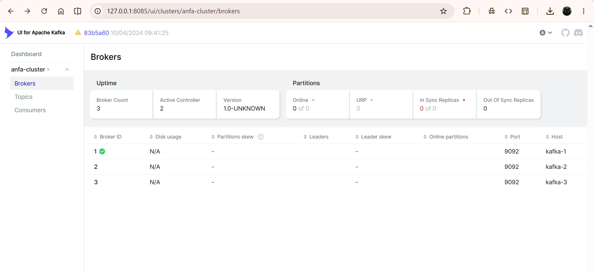
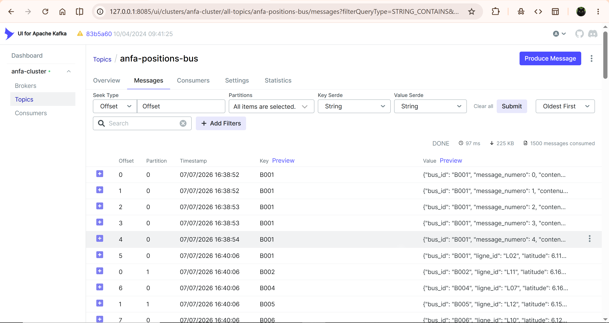
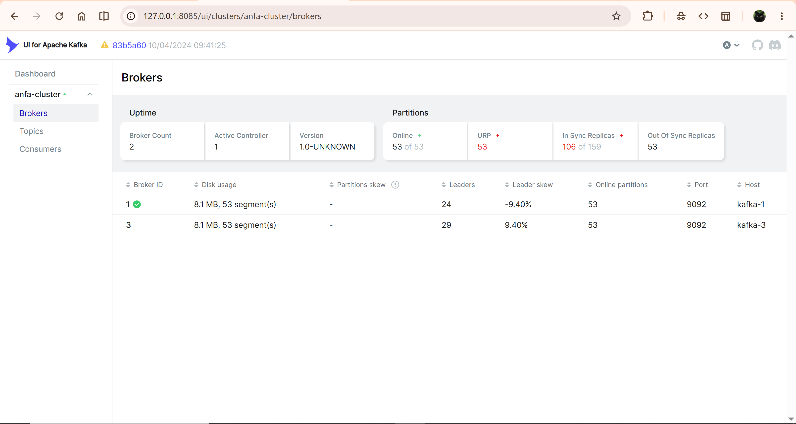
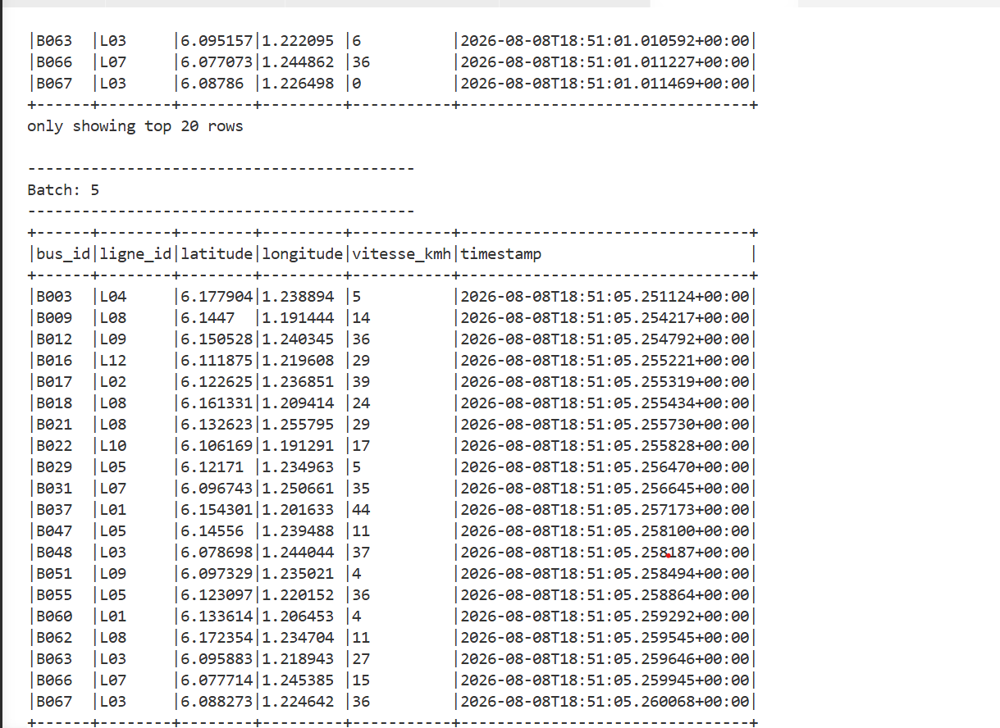
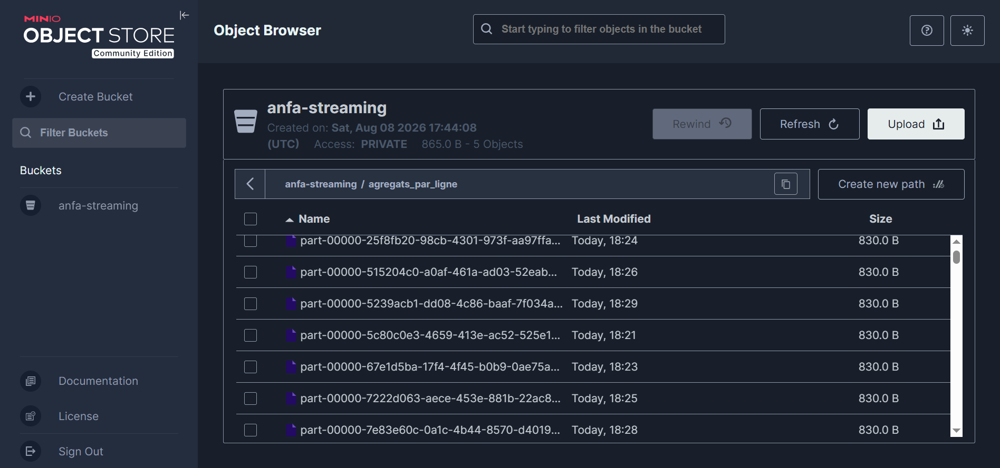

# Rendu — Séance 7

**Nom et prénom :** AHLI Kossi Sitsofé Pédro
**Identifiant GitHub :** aksp66
**Date de soumission :** 08/08/2026

## Résumé de la séance

Déploiement d'un cluster Kafka à 3 brokers en mode KRaft (sans Zookeeper), avec Kafka UI
pour l'observer. Une flotte de 100 bus Anfa a été simulée, envoyant leur position GPS en
continu sur le topic `anfa-positions-bus` (3 partitions, réplication 3). La tolérance aux
pannes a été vérifiée en arrêtant volontairement un broker : le cluster a continué de
fonctionner sans interruption ni perte de message. Enfin, Spark Structured Streaming a
consommé ce flux, d'abord affiché en console, puis agrégé par fenêtres de 30 secondes
(nombre de bus actifs et vitesse moyenne par ligne) et écrit dans MinIO au format Parquet.

## Étapes principales

1. Déploiement du cluster Kafka (3 brokers, mode KRaft) + Kafka UI.
2. Création du topic `anfa-positions-bus` (3 partitions, réplication 3).
3. Premier producer/consumer Python pour comprendre la mécanique.
4. Simulation de 100 bus envoyant leur position en continu.
5. Démonstration de tolérance aux pannes (arrêt d'un broker).
6. Spark Structured Streaming : lecture console, puis agrégation en fenêtre vers MinIO.

## Captures d'écran

### 3 brokers actifs dans Kafka UI

### Débit de messages en augmentation

### Cluster avec 2 brokers sur 3 (après arrêt volontaire)

### Micro-batchs affichés en console par Spark

### Résultats agrégés dans MinIO

## Réflexion personnelle

Kafka + Spark Streaming se justifie dès qu'une donnée perd de sa valeur si elle attend le
lendemain : la position GPS d'un bus, un capteur, une transaction à surveiller en direct.
Le pipeline batch Airflow + Spark (séances 5-6) reste pertinent pour des calculs qui
n'ont pas besoin d'immédiateté, comme un agrégat journalier des heures de pointe. La
réplication à 3 brokers m'a montré très concrètement, en arrêtant `anfa-kafka-2` pendant
que le simulateur tournait, que le cluster bascule le leadership des partitions vers les
brokers restants sans qu'aucun message ne soit perdu ni qu'aucune erreur ne remonte côté
producteur — la tolérance aux pannes n'est pas qu'un concept théorique.

## Réponses aux exercices d'application

Aucun énoncé d'exercice distinct n'a été fourni avec cette séance ; les points de
compréhension demandés par le TP (rôle de la clé de partition pour l'ordre par bus,
fonctionnement du `group_id` et des offsets, rôle du `watermark` et du `checkpointLocation`
dans le job d'agrégation) ont été vérifiés au fil des parties et sont repris dans le résumé
et la réflexion ci-dessus.

## Difficultés rencontrées

Le cluster Spark standalone de ce TP n'a qu'un seul worker avec un seul cœur disponible.
Le job console (`lecture_flux_console.py`) et le job d'agrégation
(`agregation_streaming.py`) ne peuvent donc pas tourner en même temps : le second reste
`WAITING` (« Initial job has not accepted any resources ») tant que le premier occupe
l'unique cœur. Résolu en arrêtant le job console avant de soumettre le job d'agrégation.
