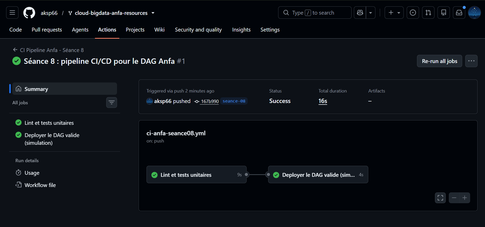
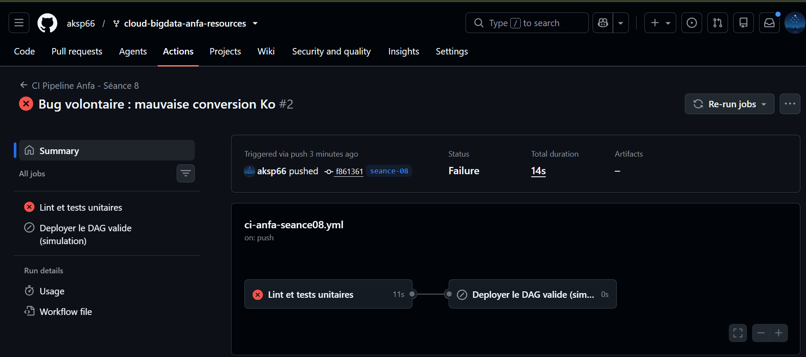

# Rendu — Séance 8

**Nom et prénom :** AHLI Kossi Sitsofé Pédro
**Identifiant GitHub :** aksp66
**Date de soumission :** 08/08/2026

## Résumé de la séance

La logique métier du DAG `anfa_pipeline_quotidien` (S6) a été extraite dans un module
Python pur (`anfa_logic.py`), testable sans installer Airflow. Un workflow GitHub Actions
(`ci-anfa-seance08.yml`) exécute automatiquement `flake8` puis `pytest` à chaque push, et
ne déclenche le job de déploiement (simulation) que si les tests passent. Un bug volontaire
introduit dans le calcul de la taille en Ko a fait échouer le job de lint/tests, bloquant
le déploiement ; le correctif a ensuite restauré un pipeline entièrement vert.

## Étapes principales

1. Séparation de la logique métier (`anfa_logic.py`) du DAG Airflow.
2. Écriture de 5 tests unitaires avec pytest.
3. Écriture du workflow GitHub Actions (lint + tests + déploiement simulé).
4. Démonstration : un bug volontaire bloque le déploiement ; correction et succès.

## Captures d'écran

### Workflow réussi (2 jobs)

### Job en échec, déploiement non exécuté

## Réflexion personnelle

Ce pipeline aurait directement empêché l'incident de Mawuli : son changement corrigeant
un bug aurait été poussé sur une branche, la CI aurait exécuté `pytest` automatiquement,
et le test aurait échoué avant même qu'un collègue n'ait besoin de relire le code — le
DAG cassé ne serait jamais arrivé sur le serveur Airflow de production. `needs:
valider-dag` change concrètement l'ordre d'exécution : le job `deployer` ne démarre que
si `valider-dag` se termine avec succès ; si les tests échouent, GitHub Actions n'essaie
même pas de lancer le déploiement, ce qu'on observe directement dans l'onglet Actions
(le job `deployer` reste grisé/« skipped »).

## Difficultés rencontrées

Aucune difficulté technique majeure. Seul point d'attention : après avoir créé la branche
`seance-08` depuis `main` sans y apporter de changement local, le premier `git push` n'a
déclenché aucune exécution du workflow (GitHub n'exécute pas les workflows filtrés par
`paths` quand le push d'une nouvelle branche ne contient aucun changement réel sous ce
chemin). Un vrai commit — ici le remplissage du `RENDU.md` — a suffi à déclencher le
premier run.
