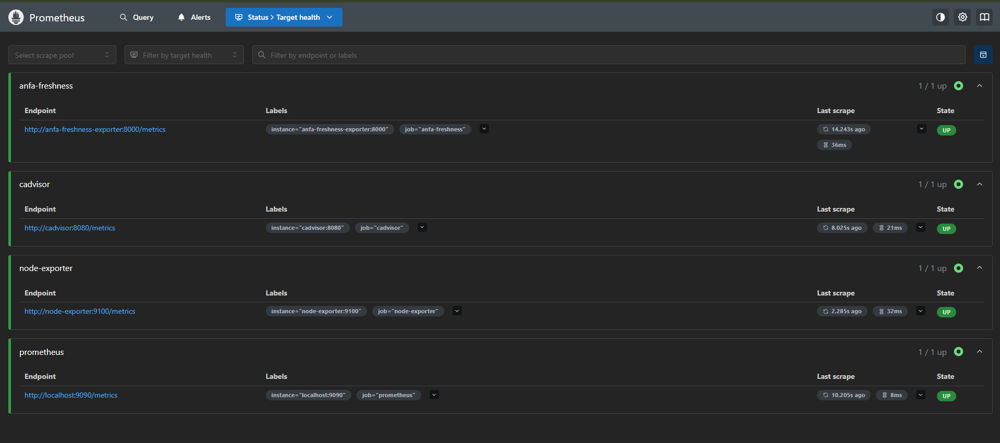
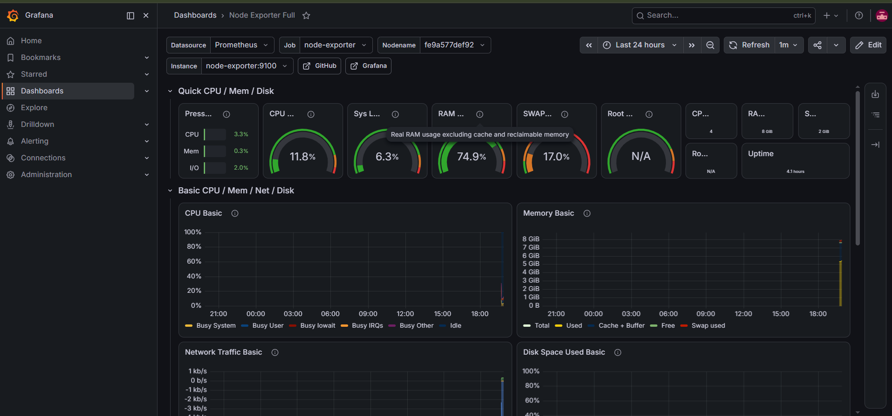
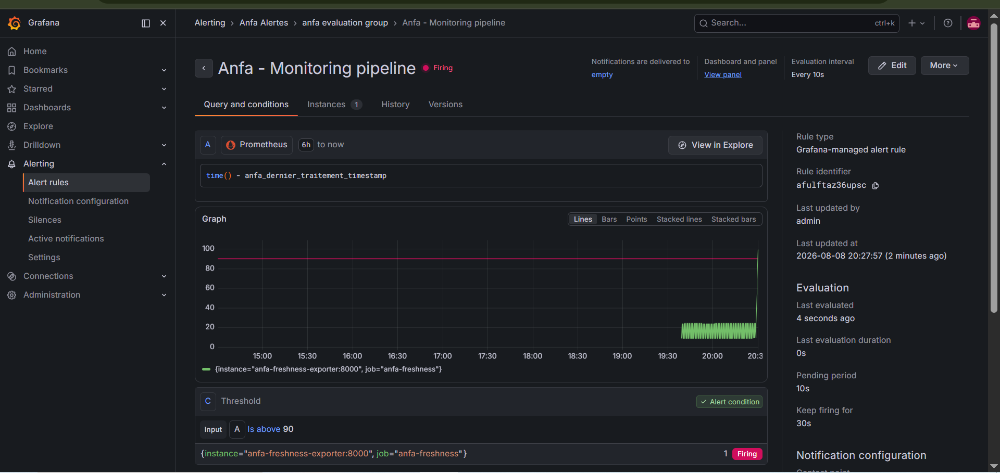

# Rendu — Séance 9

**Nom et prénom :** AHLI Kossi Sitsofé Pédro
**Identifiant GitHub :** aksp66
**Date de soumission :** 08/08/2026

## Résumé de la séance

Une stack de monitoring complète a été déployée : Prometheus (collecte), Node Exporter et
cAdvisor (métriques système/conteneurs), Grafana (visualisation), et un exportateur métier
custom simulant la fraîcheur des traitements Anfa. Les 4 cibles ont été vérifiées comme
actives dans Prometheus, un dashboard prêt à l'emploi a été importé et un panneau
personnalisé (jauge de fraîcheur avec seuils) construit dans Grafana. Une alerte a été
configurée sur cette métrique, puis déclenchée en simulant une panne silencieuse du
pipeline (aucun conteneur ne plante, mais l'horodatage du dernier traitement cesse
d'avancer) — l'alerte est passée à l'état Firing avant de revenir à Normal après réparation.

## Étapes principales

1. Déploiement de Prometheus, Node Exporter, cAdvisor, Grafana et d'un exportateur
   métier custom (fraîcheur des données Anfa).
2. Exploration des cibles Prometheus et premières requêtes PromQL.
3. Import du dashboard "Node Exporter Full" et construction d'un panneau custom.
4. Configuration d'une alerte Grafana sur la fraîcheur des données.
5. Simulation d'une panne silencieuse et observation du déclenchement de l'alerte.

## Captures d'écran

### Les 4 cibles Prometheus à l'état UP

### Dashboard "Node Exporter Full" importé

### Alerte à l'état Firing après panne simulée

## Réflexion personnelle

Cette séance répond directement au problème d'Awa dans le CM : `kubectl get pods` ou
`docker compose ps` ne montrent que "ça tourne", jamais si le résultat produit est encore
utile. En simulant la panne (fichier sentinelle `/tmp/anfa_en_panne`), tous les conteneurs
sont restés à l'état `Up` sans aucune erreur dans les logs — exactement comme le pipeline
d'Awa qui tournait sur un fichier vide sans planter. Seule la métrique de fraîcheur
(`time() - anfa_dernier_traitement_timestamp`) a révélé le problème : elle a grimpé sans
redescendre, ce qu'aucune métrique de CPU, de RAM ou de statut de conteneur n'aurait pu
montrer, puisque ces ressources restaient parfaitement normales pendant toute la panne.

## Difficultés rencontrées

Aucune difficulté majeure. Petit point d'attention : simuler la panne avec `docker stop`
sur l'exportateur aurait fait perdre la cible côté Prometheus (métrique disparue, jauge à
"No data") au lieu de la faire monter en continu — il fallait bien utiliser le fichier
sentinelle pour que le processus reste vivant tout en cessant de mettre à jour
l'horodatage, ce qui reproduit fidèlement le symptôme réel d'un pipeline silencieusement
en panne.
