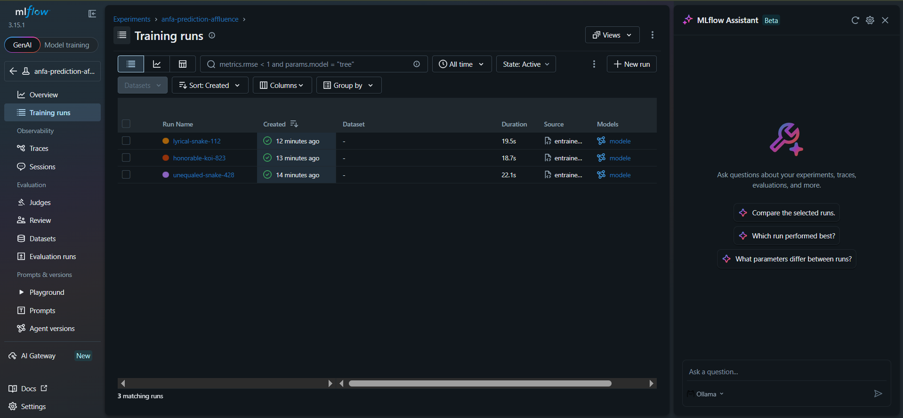
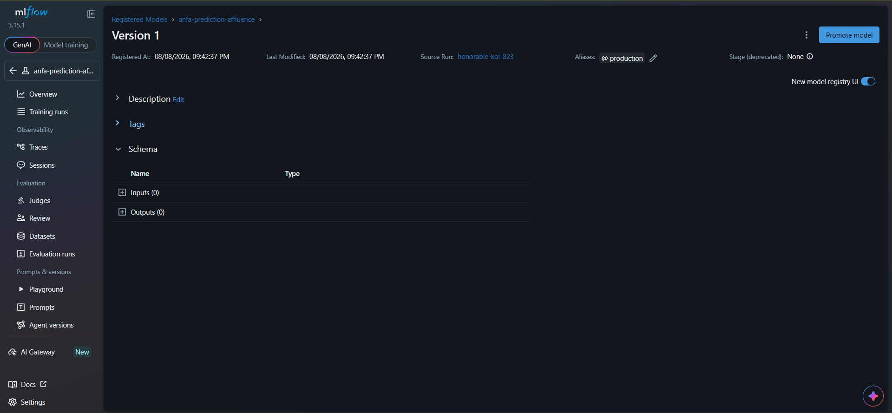

# Rendu — Séance 10

**Nom et prénom :** AHLI Kossi Sitsofé Pédro
**Identifiant GitHub :** aksp66
**Date de soumission :** 08/08/2026

## Résumé de la séance

Un serveur MLflow Tracking a été déployé (SQLite pour les métadonnées, stockage local pour
les artefacts). Trois variantes d'un modèle RandomForest prédisant l'affluence par ligne
ont été entraînées et tracées (paramètres, métriques MAE/R², modèle sérialisé), puis
comparées dans l'UI : le meilleur run (100 estimateurs, profondeur 8, R² ≈ 0,97) a été
enregistré dans le Model Registry et son alias/statut basculé en Production. Enfin, une
fiche de conformité non technique a été rédigée pour un scénario d'application mobile
Anfa collectant position GPS, historique mobile money et numéro de téléphone.

## Étapes principales

1. Déploiement d'un serveur MLflow Tracking (SQLite + stockage local).
2. Génération d'un jeu de données d'affluence Anfa et entraînement de 3 variantes
   d'un modèle RandomForest, chacune tracée avec MLflow.
3. Comparaison des runs dans l'UI et identification du meilleur candidat.
4. Enregistrement du modèle dans le Model Registry, transition en statut Production.
5. Rédaction d'une fiche de conformité pour un scénario d'application mobile Anfa.

## Captures d'écran

### Tableau des 3 runs comparés

### Modèle enregistré en statut Production

## Réflexion personnelle

Le Model Registry résout exactement le problème de Kossi : au lieu de notebooks dispersés
et de "je crois que c'est cette version qui tourne", chaque run est daté, comparable, et
un seul modèle porte le statut/alias "Production" à un instant donné — on sait avec
certitude ce qui est réellement déployé, et on peut revenir en arrière si une nouvelle
version déçoit. Le lien avec Terraform (séance 4) est direct : dans les deux cas, on
refuse de faire confiance à la mémoire ou à un nom de fichier ("model_v2_final.ipynb"
comme "terraform.tfstate local non partagé") et on s'appuie plutôt sur un état
versionné, source unique de vérité, consultable par toute l'équipe.

## Difficultés rencontrées

Incompatibilité de version entre le client MLflow et le serveur : `mlflow==2.11.3` (préconisé
par le TP) ne peut pas s'installer facilement sur Python 3.14 (pas de wheel précompilé pour
`pandas`/`pyarrow`, échec de compilation faute de compilateur C sur Windows). Résolu en
alignant le serveur Docker sur la même version récente que le client installé côté hôte
(`mlflow==3.15.1`), qui dispose de wheels précompilés. Conséquence secondaire : l'interface
et le vocabulaire ont changé par rapport au TP (les "stages" Staging/Production/Archived de
MLflow 2.x sont remplacés par des **alias** dans la nouvelle UI 3.x), mais le principe reste
identique — un seul modèle porte l'alias `production` à la fois.
